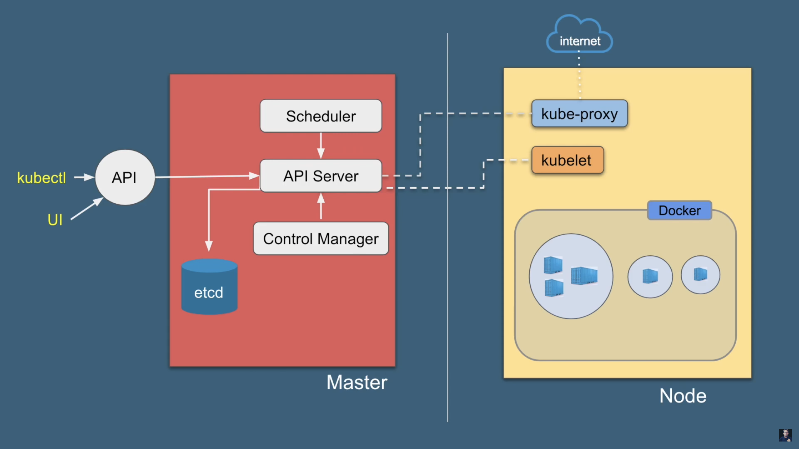

# Kubernetes architecture

- Kubernetes component
  - Master
    - Api server
      - exposes API for almost every operation
      - users/devs interact with API using **kubectl** or UI
      - communicate to etcd
    - scheduler
      - select node for pods that is newly created
      - get information for hardware config from config file at etcd via API server
    - controller manager
      - Kube-controller-manager
        - runs monitors to see failed nodes
        - types
          - Node controller -> noticing and responding when nodes go down
          - Replication controller -> maintaining the correct number of pods
          - Endpoint controller -> populate the endpoint objects (joins Services & pods)
          - Service account and token controllers -> create default accounts and API access tokens for new namespaces
        - runs as separate process but compiled into a single binary to reduce complexity
      - Cloud-controller-manager
        - types
          - Node controller -> checking the cloud provider to determine if a note has been deleted in the cloud after it stops responding
          - Route controller -> setting up routes in the underlying cloud infrastructure
          - Service controller -> creating updating and deleting could provider load balancers
          - Volume controller -> creating attaching and mounting volume, interacting with cloud provider to orchestrate volumes
    - Etcd
      - distributed key-value database from CoreOS
      - stores all the data in a kubernetes cluster
      - can also be outside the Master
  - Node
    - A Physical or virtual machine
    - contains:
      - kubelet
        - agent running on each node
        - communicates host through API server
        - makes sure that containers are running in a pod
      - kube-proxy
        - exposes services to the outside world
        - Core networking components in Kubernetes
        - watches API server on the master node for addition and removal of Services and endpoints
      - Container runtime (**kubernetes doesn't have the capability to directly handle containers and it needs a container runtime**)
        - mostly docker
  - Services (abstract layer)
    - contains:
      - pods that has same set of functions
      - domain name
  - Pod
    - contains
      - container(s)
      - volume (storage)
      - a unique network ip
  - Container
    - ex: docker container
  - add-ons
    - Dashboard
    - Monitoring
    - Logging
    - DNS

- Cluster 1 (at least)
  - Master 1 (at least)
  - Master 2
  - ...
  - Node 1 (at least)
    - pod A
      - container
      - container
      - container
    - pod B
      - container
      - container
  - Node 2
    - pod C
      - container
      - container
      - container
    - pod D
      - container
      - container
  - Node 3
  - ...
- Cluster 2
- ...
