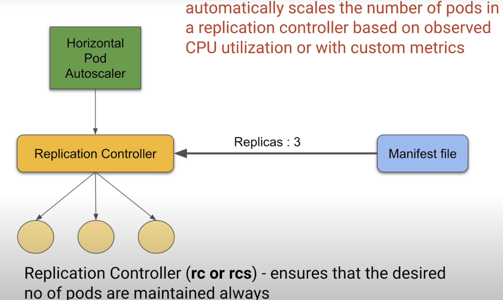

- features
  - 1 Automatic bin packing
    - packaging jobs (containers) in bins (servers) in the most efficient way

  - 2 Service discovery & load balancing
    - Kubernetes warps one or more containers into a higher-level structure called a pod, and a kubernetes service is a set of pods that work together

  - 3 Storage orchestration
    - usually a single volume is shared between containers inside a pod
    - allows to mount the volume from Local, Cloud (AWS) or Network (NFS)

  - 4 Self-healing
    - container fails -> restart container
    - node dies -> replaces and reschedule containers on other nodes
    - container fails user defined health check -> kill container

  - 5 Automated rollouts and rollbacks
    - rollout: deploy changes to the application or its configuration
    - rollback: revert the changes & restore to previous state
    - no downtime during process

  - 6 Secret & configuration management
    - two objects:
      - Secret
        - sensitive data like passwords, keys, tokens
      - Config Maps
        - handles kubernetes configurations
    - created outside pods to make them portable and easy to manage
    - separately from container image, so we can update secrets and config without rebuilding image
    - stored in ETCD (etc distributed, a key-value database) with maximum size 1MB
  - 7 Batch job execution
    - run to completion
    - creates pod(s)
    - with parallelism
    - with restart policy: Never/ on failure
    - removes pod(s) as completion
  - 8 Horizontal scaling
    - containers scalling up and downs based on:
      - commands manually
      - from dash board
      - automatically with cpu usage
    - three tools in replication controller
      - Replication controller
      - manifest file
      - Horizontal Pod Autoscaler
    
